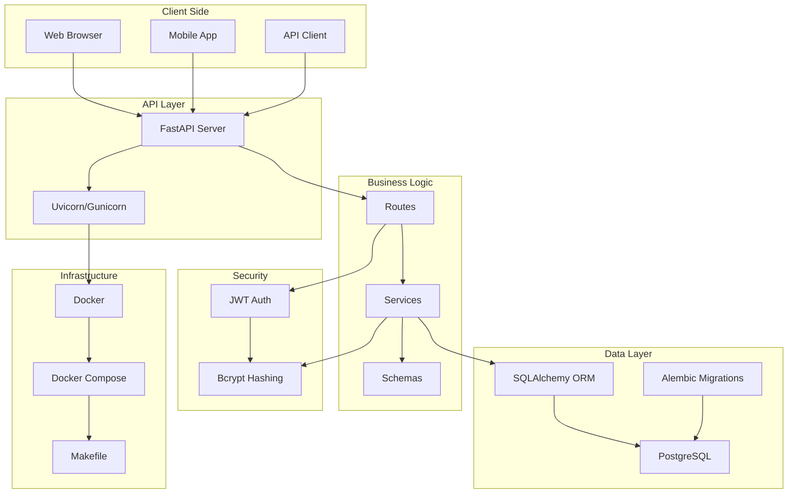
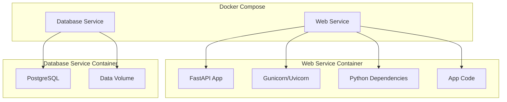
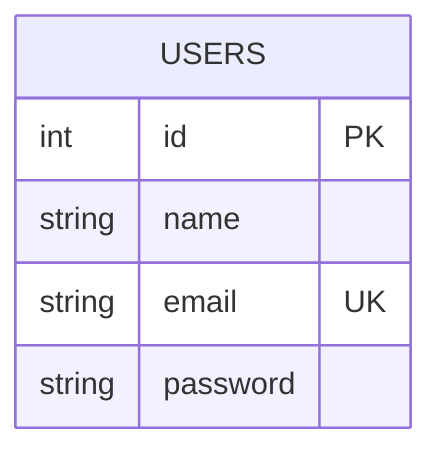
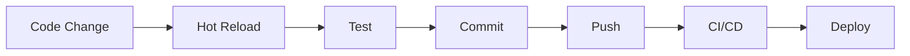
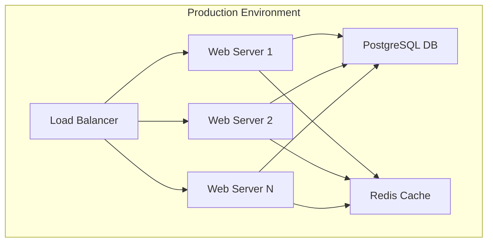

# 🏗️ FastAPI Backend Template Architecture

## 📊 System Architecture Diagram

## 🏗️ Component Overview

### 1. Client Layer
- Web browsers accessing API documentation
- Mobile applications consuming the API
- Third-party API clients

### 2. API Layer
- **FastAPI**: High-performance Python web framework
- **Uvicorn**: ASGI server for development
- **Gunicorn**: WSGI server for production

### 3. Business Logic Layer
- **Routes**: API endpoint definitions
- **Services**: Business logic implementation
- **Schemas**: Data validation and serialization

### 4. Data Layer
- **PostgreSQL**: Primary database
- **SQLAlchemy**: ORM for database operations
- **Alembic**: Database migration tool

### 5. Security Layer
- **JWT**: Token-based authentication
- **Bcrypt**: Password hashing

### 6. Infrastructure Layer
- **Docker**: Containerization
- **Docker Compose**: Multi-container orchestration
- **Makefile**: Development command shortcuts

## 🔌 Data Flow

### Request Processing
1. Client sends HTTP request
2. FastAPI routes request to appropriate handler
3. Handler validates input with Pydantic schemas
4. Service layer processes business logic
5. SQLAlchemy ORM interacts with PostgreSQL
6. Response is serialized and returned to client

### Authentication Flow
1. User registers (password hashed with bcrypt)
2. User logs in (credentials verified)
3. JWT token generated and returned
4. Subsequent requests include JWT in header
5. Token validated before processing request

## 🐳 Docker Architecture

## 🗃️ Database Schema

## 🔄 Development Workflow

## 🛠️ Deployment Architecture

## 🔧 Key Configuration Files

### Docker Configuration
- `Dockerfile`: Application container setup
- `docker-compose.yml`: Production services
- `docker-compose.override.yml`: Development overrides

### Application Configuration
- `app/main.py`: FastAPI application setup
- `app/config.py`: Environment variables
- `app/database.py`: Database connection
- `app/security.py`: Authentication functions

### Migration Configuration
- `app/migrations/alembic.ini`: Alembic settings
- `app/migrations/env.py`: Migration environment
- `app/migrations/versions/`: Migration scripts

## 📈 Scaling Considerations

### Horizontal Scaling
- Multiple web server instances
- Load balancer distribution
- Shared database connection pool

### Database Optimization
- Connection pooling
- Query optimization
- Indexing strategies
- Read replicas

### Caching Strategy
- Redis for session storage
- API response caching
- Database query caching