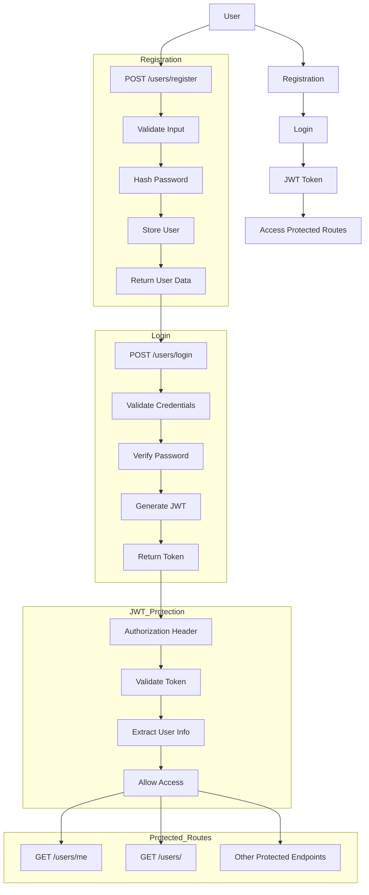

# 🔐 FastAPI Authentication Flow

## 📊 Visual Flow Diagram



## 📝 Step-by-Step Explanation

### 1. User Registration

1. **Endpoint**: `POST /users/register`
2. **Process**:
   - User provides name, email, and password
   - System validates input using Pydantic schemas
   - Password is hashed using bcrypt
   - User data is stored in PostgreSQL database
   - System returns user information (without password)

### 2. User Login

1. **Endpoint**: `POST /users/login`
2. **Process**:
   - User provides email and password
   - System validates credentials
   - Password is verified against hashed version
   - JWT token is generated with user ID
   - System returns access token and token type

### 3. JWT Token Usage

1. **Token Structure**: 
   - Header: Algorithm and token type
   - Payload: User ID and expiration time
   - Signature: Secret key-signed hash
2. **Usage**:
   - Client includes in Authorization header
   - Format: `Bearer <access_token>`
   - Server validates token on each request

### 4. Accessing Protected Routes

1. **Process**:
   - User includes JWT token in request header
   - Server validates token signature
   - Server extracts user ID from token payload
   - Server retrieves user information from database
   - Request is processed if token is valid

## 🔧 Technical Details

### Password Security
- **Hashing Algorithm**: bcrypt
- **Salt**: Automatically generated
- **Storage**: Only hashed passwords stored in database

### JWT Implementation
- **Algorithm**: HS256
- **Expiration**: Configurable (default: 60 minutes)
- **Payload**: Contains user ID (`sub` field)

### Database Models
```python
class User(Base):
    id = Column(Integer, primary_key=True)
    name = Column(String)
    email = Column(String, unique=True)
    password = Column(String)  # Hashed password
```

### API Endpoints
```python
# Registration
@router.post("/register", response_model=UserResponse)
def register_user(user: UserCreate, db: Session = Depends(get_db)):
    # Implementation

# Login
@router.post("/login", response_model=Token)
def login_user(credentials: UserLogin, db: Session = Depends(get_db)):
    # Implementation

# Protected Route
@router.get("/me", response_model=UserResponse)
def read_current_user(current_user = Depends(get_current_user)):
    # Implementation
```

## 🧪 Example Requests

### Registration
```bash
curl -X POST http://localhost:8000/users/register \
  -H "Content-Type: application/json" \
  -d '{
    "name": "John Doe",
    "email": "john@example.com",
    "password": "password123"
  }'
```

### Login
```bash
curl -X POST http://localhost:8000/users/login \
  -H "Content-Type: application/json" \
  -d '{
    "email": "john@example.com",
    "password": "password123"
  }'
```

### Access Protected Route
```bash
curl http://localhost:8000/users/me \
  -H "Authorization: Bearer YOUR_JWT_TOKEN_HERE"
```

## 🛡️ Security Considerations

1. **Never store plain text passwords**
2. **Use HTTPS in production**
3. **Validate all user inputs**
4. **Implement rate limiting**
5. **Use strong secret keys**
6. **Set appropriate token expiration**
7. **Log security events**
8. **Regularly update dependencies**